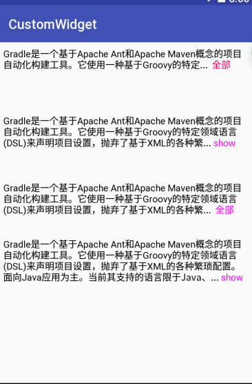

A widget Inspired by http://blog.csdn.net/tanxuewe/article/details/50793630

# FolderTextView
折叠文本, 详情介绍内容无法完全显示,进行折叠处理,可以自定义折叠文字,颜色,折叠行数,及能否折叠.



## 快速使用 Quick Start

1. **build.gradle 加入 dependencies**


      implementation 'me.leon406:foldertextview:1.0.1@aar'//AS3.0+ 建议
      compile 'me.leon406:foldertextview:1.0.1@aar'       //AS3.0以下
2. **xml layout**

      <me.leon.foldertextview.FolderTextView
            android:layout_width="wrap_content"
            android:layout_height="wrap_content"
            app:fold_line="4"
            android:text="@string/text1"
            app:fold_text="   hide"
            app:fold_text_color="#0f0"
            app:unfold_text=" show"
            app:unfold_text_color="#f0f" />

3. **使用方法**

```
((FolderTextView) findViewById(R.id.tv2)).setText(text); //与TextView一致
```

### 

## 相关属性

       <declare-styleable name="FolderTextView">
            <attr name="fold_line" format="integer" />   		//折叠行数,默认2
            <attr name="noFold"  format="boolean"/>     		// 能否折叠,默认false
            <attr name="fold_text"  format="string"/>    		//折叠文字,默认'折叠'
            <attr name="unfold_text"  format="string"/>    	 	//展开文字,默认'全部'
            <attr name="fold_text_color"  format="color"/> 		//折叠文字颜色,默认'红色'
            <attr name="unfold_text_color"  format="color"/>	//展开文字颜色,默认'蓝色'
        </declare-styleable>
### 